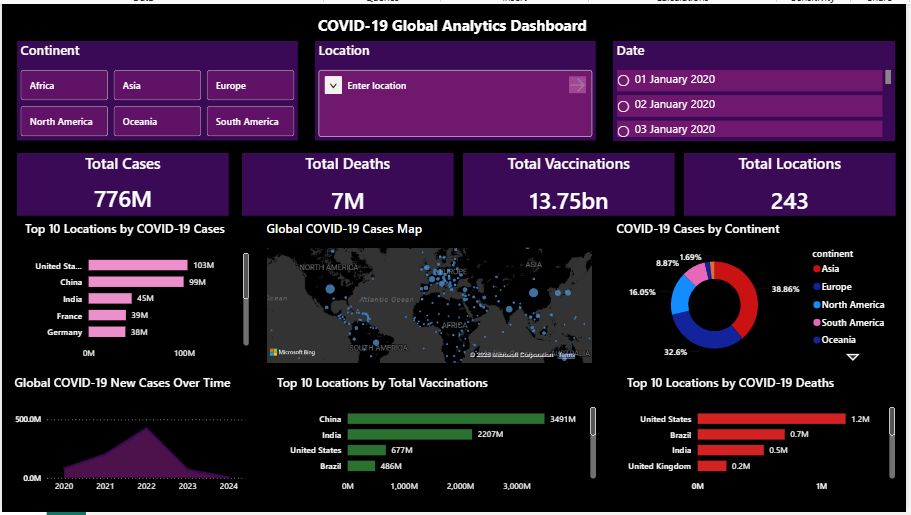

# 🦠 COVID-19 Global Analytics

> An interactive Power BI dashboard analyzing global COVID-19 cases, deaths, testing, and vaccination trends using Python, Pandas, and real-world data.

## 📊 Dashboard Preview

## 📌 Project Overview

The COVID-19 Global Analytics project focuses on analyzing global COVID-19 data to understand the spread and impact of the pandemic across different countries and continents.

The project covers the complete data analytics process, starting from data cleaning and preparation in Python to exploratory analysis and interactive visualization in Power BI.

The dashboard provides a clear view of COVID-19 cases, deaths, testing, vaccination progress, and country-wise trends.

## 🎯 Objectives

- Analyze COVID-19 cases and deaths over time
- Compare the impact of COVID-19 across countries and continents
- Analyze testing and vaccination trends
- Identify patterns and trends in the data
- Explore population and demographic indicators
- Build an interactive Power BI dashboard
- Present meaningful insights through data visualization

## 🛠️ Tools & Technologies

- **Python**
- **Pandas**
- **NumPy**
- **Jupyter Notebook**
- **Microsoft Excel**
- **Power BI**
- **GitHub**

## 📂 Dataset

The project uses a global COVID-19 dataset containing information related to cases, deaths, testing, vaccinations, population, and demographic indicators.

### Dataset Overview

- **Original records:** 429,435
- **Original columns:** 67
- **Columns selected for analysis:** 25
- **Duplicate records found:** 0

### Main Variables

- `location`
- `continent`
- `date`
- `total_cases`
- `new_cases`
- `total_deaths`
- `new_deaths`
- `total_tests`
- `new_tests`
- `positive_rate`
- `tests_per_case`
- `total_vaccinations`
- `people_vaccinated`
- `people_fully_vaccinated`
- `total_boosters`
- `new_vaccinations`
- `population`
- `population_density`
- `gdp_per_capita`
- `life_expectancy`
- `hospital_beds_per_thousand`
- `human_development_index`

## 🧹 Data Cleaning & Preparation

The dataset was cleaned and prepared using Python and Pandas.

The main steps included:

- Loading and exploring the raw dataset
- Selecting relevant columns
- Checking data types
- Checking duplicate records
- Analyzing missing values
- Removing records without continent information
- Converting the date column into datetime format
- Preparing the cleaned data for analysis and visualization

A sample of the cleaned dataset has been included in the repository for reference.

## 📈 Dashboard Analysis

The Power BI dashboard provides an interactive view of:

### 🦠 COVID-19 Cases
- Total cases
- New cases
- Case trends over time
- Country-wise comparison
- Continent-wise comparison

### ⚰️ Deaths
- Total deaths
- New deaths
- Death trends
- Country-wise comparison

### 🧪 Testing
- Total tests
- New tests
- Positive test rate
- Tests per case
- Country-wise testing comparison

### 💉 Vaccination
- Total vaccinations
- People vaccinated
- Fully vaccinated population
- Booster vaccinations
- Vaccination trends

### 🌍 Population & Demographics
- Population
- Population density
- GDP per capita
- Life expectancy
- Hospital beds per thousand
- Human Development Index

## 💡 Key Insights

The dashboard enables analysis of:

- COVID-19 case and death trends over time
- Countries with higher reported cases and deaths
- Differences in COVID-19 impact across continents
- Testing patterns across countries
- Vaccination progress over time
- Relationship between reported cases and deaths
- Differences in population and demographic indicators

## 🔄 Project Workflow

**Raw Data → Data Cleaning → Exploratory Analysis → Data Preparation → Power BI Visualization → Dashboard → Insights**

## 📁 Project Structure

COVID-19-Global-Analytics/
│
├── COVID-19_Global_Analytics.pbix
├── Dashbored.PNG
├── covid_analysis.ipynb
├── covid_cleaned_sample.csv
├── latest_data.csv
└── README.md

## 👩‍💻 Author

**Anu**  
MCA Graduate | Aspiring Data Analyst

⭐ If you found this project useful, feel free to star the repository!
